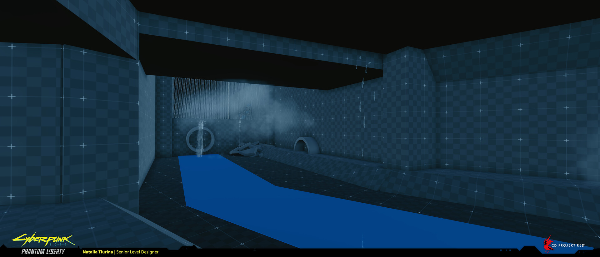

# Level design by Natalia Tiurina

For more info check [Natalia's Portfolio ](https://www.artstation.com/tasha-chan)

<figure><figcaption>
Kurt's place @ Natalia Tiurina portfolio
</figcaption></figure>

> One of the most intense beats in Phantom Liberty is the Firestarter quest, where player, disguised as one of the netrunenner twins, infiltrates Kurt's hideout located in the stadium. I was responsible for the design of the whole section, blockout, initial combat setup and gameplay iterations. . While working on this section, our team faced numerous challenges — such as creating this sequence with a highly spy-like vibe, supporting multiple gameplay paths and choices, reflecting various changes in the environmental storytelling, crafting memorable combat and stealth sections, and many others.

<figure><figcaption>
Scape from Kurt's place @ Natalia Tiurina portfolio
</figcaption></figure>

> Depending on the player's choice in the Firestarter quest - whether it's Songbird or Reed - the exit path from the stadium will differ. With Songbird, the player navigates through the collecter sewer, while with Reed, the player makes their way through the utility room and parking lot. I was responsible for the design of both locations, blockouts, initial combat setup and gameplay iterations.

<figure><figcaption>
 Heavy Hearts Club @ Natalia Tiurina portfolio
</figcaption></figure>

> The pyramid-shaped Heavy Hearts Club serves as a landmark of Dogtown and is a favorite spot for the local elite.

<figure><figcaption>
Stadium Parking @ Natalia Tiurina portfolio
</figcaption></figure>

> This is one of the initial locations in the Phantom Liberty expansion, through which player navigates into Dogtown - the abandoned and intimidating automated underground parking. I was responsible for the initial concept and design of the location, blockout and gameplay iterations. Assembling this huge place, finding the balance between engaging but not-too-punishing gameplay...

<figure><figcaption>
Stadium Roof @ Natalia Tiurina portfolio
</figcaption></figure>

> In order to witness the crash of Space Force One, the player must ascend and pass through the partially demolished roof of the stadium.

<figure><figcaption>
Stadium Roof @ Natalia Tiurina portfolio environment by <a href="https://www.artstation.com/jpthrash">Javier Pintor</a>
</figcaption></figure>

Quote from [Javier Pintor portfolio](https://www.artstation.com/artwork/6Nz0nN):

> The Stadium Gate, from the very first quest “Dog Eat Dog” is an imposing structure that serves as a security checkpoint to “Dogtown” Its aggressive look is a testament to the powers that control this part of the city.
