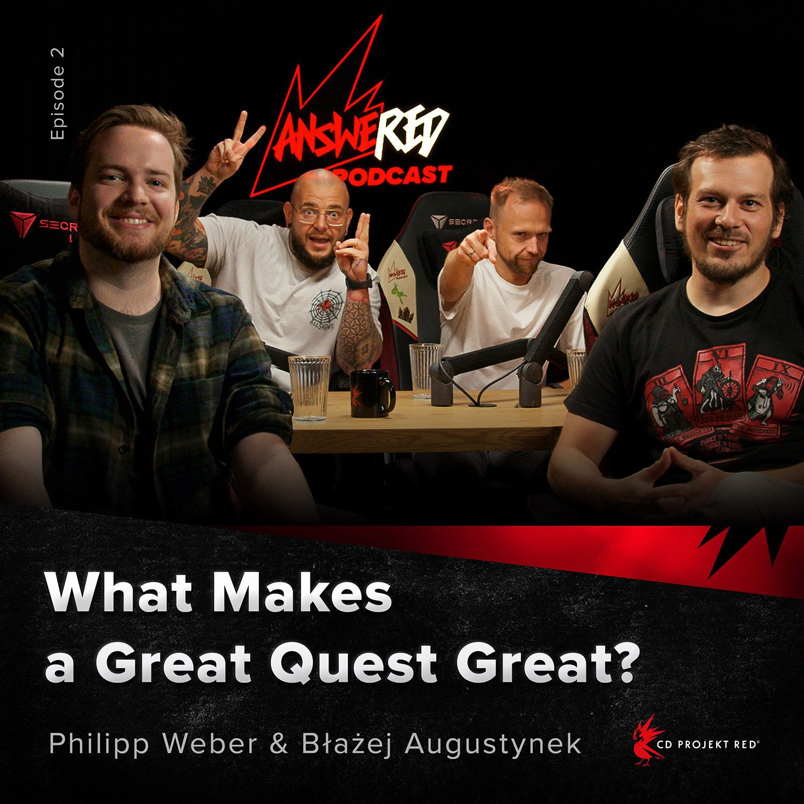

# What makes a great quest great!

Hosts [Sebastian Kalemba](https://www.linkedin.com/in/ACoAAAIWiYQBDWU3bzcNXJgbBroKora\_l6Ux1sU) and [Pawel Burza](https://www.linkedin.com/in/ACoAAAr1-i0BlokkJ19CMaaPXPDsjjUrnS6DiM0) are joined by Lead Quest Designer [Błażej Augustynek](https://www.linkedin.com/in/ACoAAAqUOaIBQcL-pW4-7GzmcCYljvNHbpBq3yU) and Narrative Director [Philipp Weber](https://www.linkedin.com/in/ACoAABT04LoB1RKH1qwU8FgoBPyoUguJzz-tZnw) to talk about great quests and how to make them.\
\

<figure><figcaption></figcaption></figure>



Or listen to the podcast on Spotify: \
[https://open.spotify.com/episode/6IVuJtmmmBzpFhuvVP7bs6](https://open.spotify.com/episode/6IVuJtmmmBzpFhuvVP7bs6)

