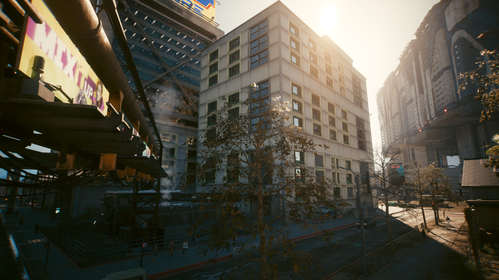
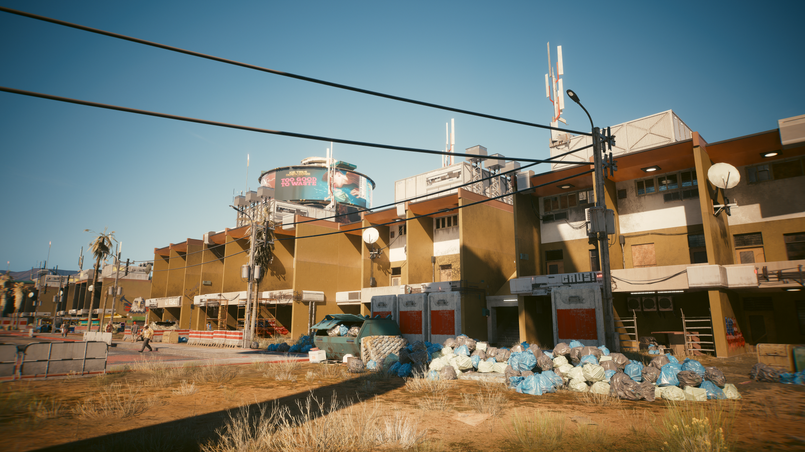
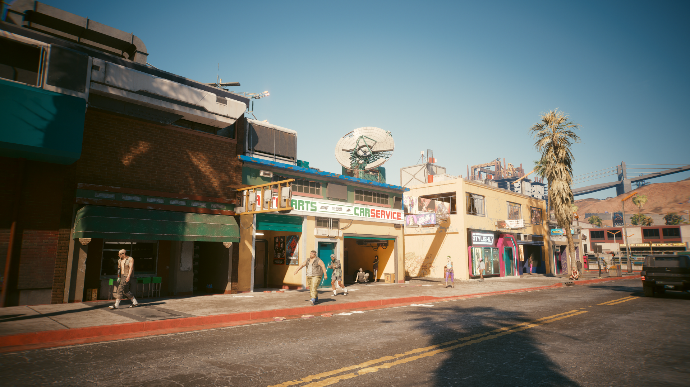

# Entropism

###

<figure><figcaption>
Source: CP2077 Design Bible @Digital Dragons. (2022, June 28). <em>Creating diverse dystopian Cyberpunk 2077 Night City</em> [Video]. YouTube. https://www.youtube.com/watch?v=kLL1zFQPE7s
</figcaption></figure>

### NECESSITY OVER STYLE

Entropism is the style of poverty. We encounter it in the neglected parts of Night City, where the bottom rung of society has been left to its own devices. The products of Entropism are crude—ugly, even—yet durable. As its catchphrase suggests, it is design governed by necessity, not esthetics.

<figure><figcaption>
Vladimír Vilimovský Portfolio
</figcaption></figure>

Entropism embodies the breakdown the Fourth Corporate War left in its wake. When supply lines and international trade collapsed, an enormous crisis followed, leaving people to find ways to survive by any means and using whatever was available to them. That lead to the emergence of a new style that valued cost efficiency and getting the job done above all else. Corporations and tinkerers alike started producing cheap, crude implants and vehicles, hacks to get people through hard times. By 2077, some vintage examples from Entropism’s heyday are still in use, but most products made in this style that we encounter are new. Plenty of companies still manufacture cheap goods for those that can afford only the lowest of the low-end.

_<mark style="color:yellow;">The official digital artbook of Cyberpunk 2077</mark>_<mark style="color:yellow;">. (n.d.). https://www.cyberpunk.net/artbook/en/</mark>

<figure><figcaption>
Waldek Kamiński – Senior Concept Artist – CD PROJEKT RED – Cyberpunk 2077
</figcaption></figure>

<figure><figcaption>
Marcin Klicki – Senior Character Artist
</figcaption></figure>

<figure><figcaption>
Ward Lindhout – Senior Concept Artist – CD PROJEKT RED – Cyberpunk 2077
</figcaption></figure>

<figure><figcaption>
Sergey Glushakov - Senior Concept Artist
</figcaption></figure>

<figure><figcaption>
Marta Leydy - Environment concept artist
</figcaption></figure>

<figure><figcaption>
Maciej Rebisz  - Concept Artist
</figcaption></figure>

<figure><figcaption>
Ben Andrews - Associate Art Director
</figcaption></figure>

<figure><figcaption>
Kacper Niepokólczycki – Lead Environment Artist
</figcaption></figure>

<figure><figcaption>
Lukasz Poduch - Concept Artist
</figcaption></figure>

<figure><figcaption>
Paweł Breshke Czyżewski - Automotive Designer, Sr Concept Vehicle Designer
</figcaption></figure>

### In game Entropism:

<figure><figcaption>
Entropism clothing/Style
</figcaption></figure>

 

<figure><figcaption></figcaption></figure>

 

<figure><figcaption></figcaption></figure>

<figure><figcaption></figcaption></figure>
