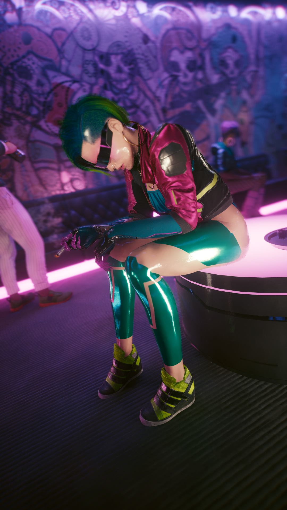

# Kitsch

<figure><figcaption>
Source: CP2077 Design Bible @Digital Dragons. (2022, June 28). <em>Creating diverse dystopian Cyberpunk 2077 Night City</em> [Video]. YouTube. https://www.youtube.com/watch?v=kLL1zFQPE7s
</figcaption></figure>

### STYLE OVER SUBSTANCE

Kitsch, the first of our four styles, is the lingua franca of the street. Every Night City neighborhood is awash with it, especially when focused on recreation and entertainment. Its “style over substance” mantra blares out from the objects of everyday life. Colorful and eye-catching, they must grab their potential buyers’ attention in the store and distinguish them from the crowd on the street. Function comes second; looks are what matter.

<figure><figcaption>
Vladimír Vilimovský Portfolio
</figcaption></figure>

Historically, Kitsch's spread coincided with the cultural revolution brought about by braindance technology. Worn down by the harshness of reality, people began to fulfill their unattainable dreams through braindance sessions. Fame, wealth, thrills, even the simple satisfaction of a happy day—anything could be achieved in a properly-tuned session. This unmooring from reality gave birth to a garish, gaudy style, marked by tacky colors and a flaunting of implants that had ceased to be mere prosthetics or unpleasant necessities. Instead, cyberware emerged as the core of a new subculture, one obsessed with owning and displaying modified body parts. Kitsch is a scream echoing through an age of crisis, war and failing states. It is the style of anarchy, of rebellion against a social order represented by corruption and all-crushing corporations. Though briefly disposed by Entropism in the years following its rise, it soon roared back and remains omnipresent and inescapable on the street.

_<mark style="color:yellow;">The official digital artbook of Cyberpunk 2077</mark>_<mark style="color:yellow;">. (n.d.). https://www.cyberpunk.net/artbook/en/</mark>

<figure><figcaption>
Waldek Kamiński – Senior Concept Artist – CD PROJEKT RED – Cyberpunk 2077
</figcaption></figure>

<figure><figcaption>
Sebastian Bąkała – Senior Character Artist
</figcaption></figure>

<figure><figcaption>
Timur Ozdoev - Senior Environment Artist
</figcaption></figure>

<figure><figcaption>
Marta Leydy - Environment concept artist
</figcaption></figure>

<figure><figcaption>
Ben Andrews - Associate Art Director
</figcaption></figure>

<figure><figcaption>
Paweł Breshke Czyżewski - Automotive Designer, Sr Concept Vehicle Designer
</figcaption></figure>

<figure><figcaption>
Paweł Breshke Czyżewski - Automotive Designer, Sr Concept Vehicle Designer
</figcaption></figure>

<figure><figcaption>
Ben Andrews - Associate Art Director
</figcaption></figure>

### In game Kitsch:

<figure><figcaption></figcaption></figure>

 

<figure><figcaption></figcaption></figure>

<figure><figcaption>
half entropism and half kitsch elements
</figcaption></figure>

<figure><figcaption>
Kitsch clothing on NPC's
</figcaption></figure>

<figure><figcaption>
A Mox member
</figcaption></figure>
