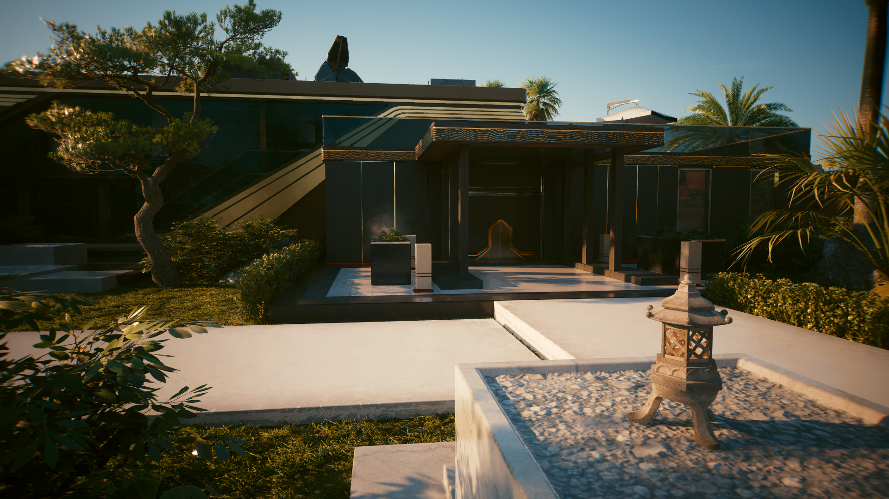
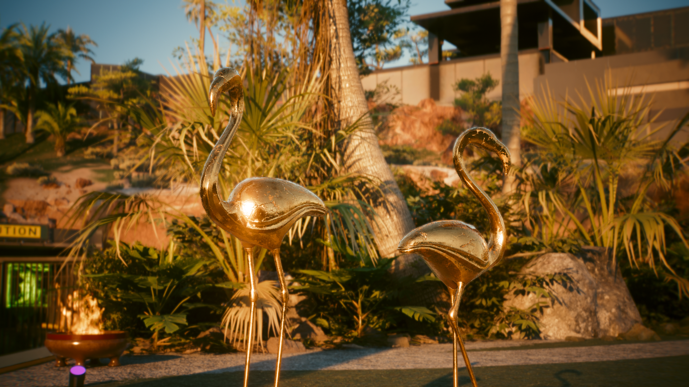
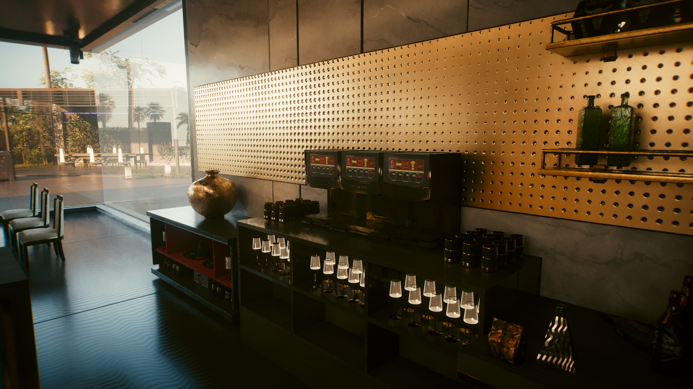
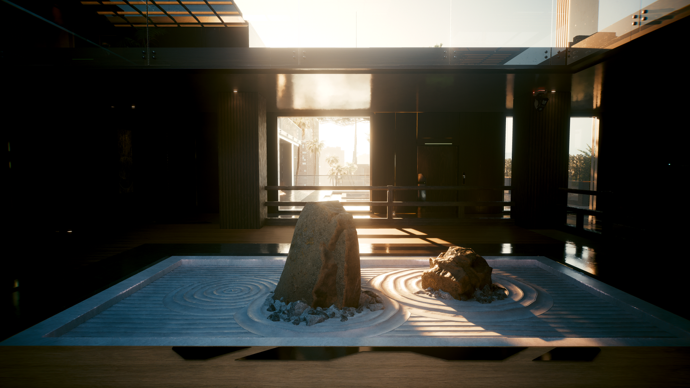

# Neo Kitsch

<figure><figcaption>
Source: CP2077 Design Bible @Digital Dragons. (2022, June 28). <em>Creating diverse dystopian Cyberpunk 2077 Night City</em> [Video]. YouTube. https://www.youtube.com/watch?v=kLL1zFQPE7s
</figcaption></figure>

### STYLE AND SUBSTANCE

This is the last and most recently developed style in the fictional reality of 2077 that we've created. When the Treaty of Unification brought an end to the war between the United States and the Free States in 2070, Night City gained independence from both, claiming a new status as an international free city. With the risk of destruction lifted and the city’s new leaders determined to adopt corporation-friendly policies, capital once again poured in—and was captured by an elite new aristocracy.

<figure><figcaption>
Vladimír Vilimovský Portfolio
</figcaption></figure>

Thus Neokitsch was born, the style of celebrities, braindance stars, magnates, heirs to corporate fortunes and corporate CEOs—the point-one percent of the wealthiest and most influential Night Citizens, those who have become bored of the chrome, black and graphite of their suits and armored vehicles. Surrounded in everyday life by the cold style of the corporate overclass, they abandon it for gold, silver and platinum, for the warmth of real wood, ivory and natural furs—rare and exclusive materials only they can afford. Neokitsch is, in a certain sense, a return to the roots of Kitsch, while also acting as a show of forceful luxury by people with so much money they need not care about the opinions of others. It is the style of demigods, the living legends of this world.

_<mark style="color:yellow;">The official digital artbook of Cyberpunk 2077</mark>_<mark style="color:yellow;">. (n.d.). https://www.cyberpunk.net/artbook/en/</mark>

<figure><figcaption>
Maciej Caputa - Senior Environment Artist
</figcaption></figure>

<figure><figcaption>
Maciej Caputa - Senior Environment Artist
</figcaption></figure>

<figure><figcaption>
Sebastian Bąkała – Senior Character Artist
</figcaption></figure>

<figure><figcaption>
Maciej Paczkowski - Lead Character Artist
</figcaption></figure>

<figure><figcaption>
Maciej Paczkowski - Lead Character Artist
</figcaption></figure>

<figure><figcaption>
Martin Kocisek – Senior Environment Artist
</figcaption></figure>

<figure><figcaption>
Zuzanna Dąbrowa – Environment Level Artist
</figcaption></figure>

<figure><figcaption>
Maciej Rebisz  - Concept Artist
</figcaption></figure>

<figure><figcaption>
Ward Lindhout - Senior Concept Artist
</figcaption></figure>

<figure><figcaption>
Paweł Breshke Czyżewski - Automotive Designer, Sr Concept Vehicle Designer
</figcaption></figure>

<figure><figcaption>
Ben Andrews - Associate Art Director
</figcaption></figure>

### In game Neo Kitsch:

<figure><figcaption></figcaption></figure>

 

<figure><figcaption></figcaption></figure>

 

<figure><figcaption></figcaption></figure>

<figure><figcaption></figcaption></figure>

 

<figure><figcaption></figcaption></figure>

<figure><figcaption></figcaption></figure>
