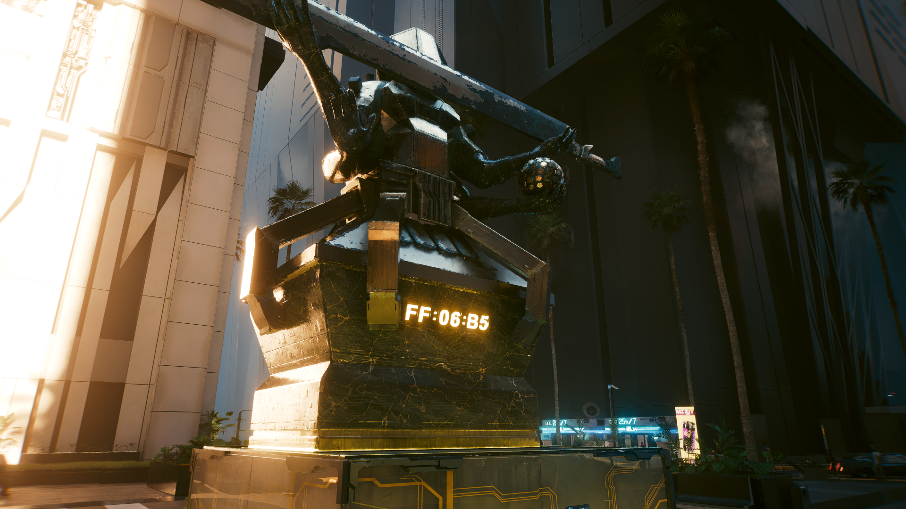

# Neo Militarism

###

<figure><figcaption>
Source: CP2077 Design Bible @Digital Dragons. (2022, June 28). <em>Creating diverse dystopian Cyberpunk 2077 Night City</em> [Video]. YouTube. https://www.youtube.com/watch?v=kLL1zFQPE7s
</figcaption></figure>

### SUBSTANCE OVER STYLE

Neomilitarism, our third style chronologically, adds a layer of deadly elegance and corporate, militaristic fashion to the stylistic mix of its predecessors. It is mostly encountered in the wealthier parts of the city, especially corporate zones and business districts. This style is epitomized by the catchphrase “substance over style,” according to which products should be forceful, functional and high-quality rather than flashy. Neomilitarism’s distinctive features are its cold, threatening elegance and formality, highlighted by the visible presence of militaristic accents.

<figure><figcaption>
Vladimír Vilimovský Portfolio
</figcaption></figure>

Historically, Neomilitarism has its roots in the crisis that followed the Fourth Corporate War. The devastation that came on the heels of that conflict hit everyone hard, corporations and governments included. Once the dust settled and countries began more or less successful attempts to restore their authority, megacorporations like Arasaka and Militech saw an opportunity to carve out their own empires. They leapt into the fray and emerged holding a bigger hunk of the pie than ever before. Thus began a new era, one marked by Neomilitarism--a style that came to symbolize recovery and redoubled corporate dominance.

_<mark style="color:yellow;">The official digital artbook of Cyberpunk 2077</mark>_<mark style="color:yellow;">. (n.d.). https://www.cyberpunk.net/artbook/en/</mark>

<figure><figcaption>
Joseph Noel – Concept Artist – CD PROJEKT RED – Cyberpunk 2077
</figcaption></figure>

<figure><figcaption>
Marcin Tomalak – Concept Artist
</figcaption></figure>

<figure><figcaption>
Sergey Glushakov - Senior Concept Artist
</figcaption></figure>

<figure><figcaption>
Maciej Rebisz  - Concept Artist
</figcaption></figure>

<figure><figcaption>
Ward Lindhout - Senior Concept Artist
</figcaption></figure>

<figure><figcaption>
Ben Andrews - Associate Art Director
</figcaption></figure>

<figure><figcaption>
Paweł Breshke Czyżewski - Automotive Designer, Sr Concept Vehicle Designer
</figcaption></figure>

<figure><figcaption>
Marek Brzezinski – Concept Artist
</figcaption></figure>

### In game Neomilitarism:

<figure><figcaption></figcaption></figure>

 

<figure><figcaption></figcaption></figure>

 

<figure><figcaption></figcaption></figure>

<figure><figcaption></figcaption></figure>

 

<figure><figcaption></figcaption></figure>

<figure><figcaption></figcaption></figure>
