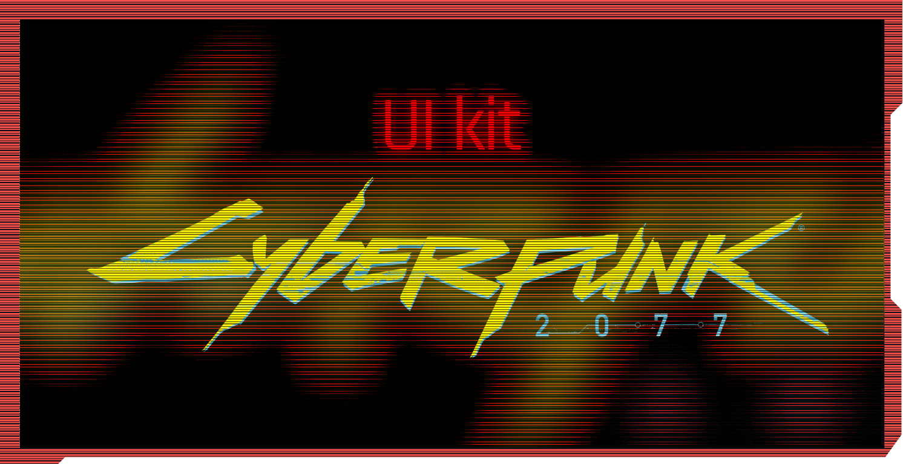

# UI

For a long time I've been working on doing a UI kit for maintain a consistency on Mods, Publications or the same wiki, as a designer I attempt to that, you can visualize the wiki or duplicate the file so you can use it on your own account:

<figure><figcaption></figcaption></figure>

[https://www.figma.com/community/file/1319682612115800202](https://www.figma.com/community/file/1319682612115800202)\
\
This wiki is still on progress, I always add new stuff when I have time


Last iteration December 2023


